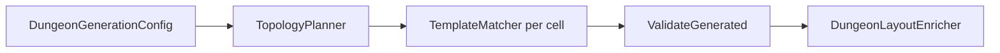
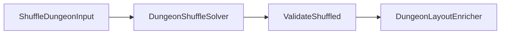

# IsaacDungeonLayout — документация

Чистая **C#**-библиотека генерации подземелий в духе *The Binding of Isaac*: топология на сетке `Int2`, шаблоны комнат с поворотами, валидация инвариантов, обогащение **игровыми метаданными** и второй режим **shuffle** (перестановка комнат на заданном графе с максимизацией дистанции Start→End).

**Без зависимости от Godot** в коде алгоритмов; интеграция в движок описана отдельно.

---

## Оглавление

1. [Быстрый старт](docs/GettingStarted.md) — сборка, тесты, первые вызовы API  
2. [Два режима работы](#2-два-режима-работы)  
3. [Структура репозитория](#3-структура-репозитория)  
4. [Ключевые типы](#4-ключевые-типы)  
5. [Пайплайны](#5-пайплайны)  
6. [Валидация и `DungeonLayout.Source`](#6-валидация-и-dungeonlayoutsource)  
7. [Интеграция в Godot](#7-интеграция-в-godot)  
8. [Расширение и настройка](#8-расширение-и-настройка)  
9. [Риски и ограничения](#9-риски-и-ограничения)  
10. [Связанные документы](#10-связанные-документы)

---

## 2. Два режима работы

| Режим | Вход | Выход | Валидация |
|--------|------|--------|-----------|
| **С нуля** (`Generate`) | [`DungeonGenerationConfig`](Core/DungeonGenerationConfig.cs): шаблоны, `BaseRoomCount`, `MobRoomCount`, `Seed`, `MaxAttempts`, опционально [`TemplateUsageCapsById`](Core/DungeonGenerationConfig.cs), опционально расширение Plug ([`AllowTopologyPlugExpansion`](Core/DungeonGenerationConfig.cs), [`DeckFeasibility`](Generation/DeckFeasibility.cs)) | [`DungeonLayout`](Core/DungeonLayout.cs), `Source = Generated`, заполненная [`DungeonTopologyTrace`](Core/DungeonTopologyTrace.cs) (поле `PlugCellPositions` при авто-заглушках) | [`ValidateGenerated`](Validation/DungeonValidator.cs) — при отсутствии Plug: leaf/maximin; при Plug — эти инварианты пропускаются |
| **Shuffle** (`Shuffle`) | [`ShuffleDungeonInput`](Core/ShuffleDungeonInput.cs): множество клеток, фиксированный старт, пул [`RoomSlotDescriptor`](Core/RoomSlotDescriptor.cs), каталог шаблонов, `Seed` | Тот же `DungeonLayout`, `Source = Shuffled`, **пустая** топология-трасса | [`ValidateShuffled`](Validation/DungeonValidator.cs); опционально сверка множества клеток с исходным графом |

После успеха в обоих режимах вызывается [`DungeonLayoutEnricher.Enrich`](Generation/DungeonLayoutEnricher.cs): у каждой [`PlacedRoom`](Core/PlacedRoom.cs) появляется `GameplayMetadata` (см. [docs/RoomGameplayMetadata.md](docs/RoomGameplayMetadata.md)).

Подробно про shuffle: [docs/ShuffleMode.md](docs/ShuffleMode.md).  
Подробно про метаданные: [docs/RoomGameplayMetadata.md](docs/RoomGameplayMetadata.md).

---

## 3. Структура репозитория

| Папка / файл | Назначение |
|--------------|------------|
| [`Core/`](Core/) | `Int2`, `RoomTemplate`, `PlacedRoom`, `DungeonLayout`, конфиги, `ShuffleDungeonInput`, `RoomSlotDescriptor`, исключения |
| [`Generation/`](Generation/) | `DungeonGenerator`, `TopologyPlanner`, `TemplateMatcher`, `DungeonShuffleSolver`, `DungeonLayoutEnricher`, `GridBfs`, … |
| [`Validation/`](Validation/) | `DungeonValidator` (`ValidateGenerated` / `ValidateShuffled`) |
| [`Demo/`](Demo/) | [`DemoTemplates`](Demo/DemoTemplates.cs) — набор шаблонов для тестов и прототипов |
| [`Tests/`](Tests/) | Консольные прогоны без NUnit: smoke, stress, helper, metadata, shuffle |
| [`docs/`](docs/) | Углублённые заметки: GettingStarted, ShuffleMode, RoomGameplayMetadata |
| [`Program.cs`](Program.cs) | Точка входа `dotnet run -- …` |
| [`GodotIntegration.md`](GodotIntegration.md) | Пошаговая интеграция в Godot C# |

---

## 4. Ключевые типы

- **`Int2`** — целочисленная пара `(X, Z)` на сетке комнат; в Godot обычно мапится на `(x, 0, z)`.
- **`RoomTemplate`** — id, [`RoomType`](Core/RoomType.cs), список выходов в **локали шаблона** (кардинальные единичные векторы), до поворота.
- **`PlacedRoom`** — итог размещения: позиция, тип, `TemplateId`, `RotationSteps90`, `FinalOutsDir` в мировых осях, `ConnectedNeighborPositions`, опционально **`GameplayMetadata`** после enricher.
- **`DungeonLayout`** — список комнат, `StartPosition` / `EndPosition`, `MobPositions`, `StartEndGraphDistance`, `Topology`, поле **`Source`** (`Generated` | `Shuffled`).
- **`DungeonGenerationOutcome`** — `Success`, `Result`, `Failure`, `AttemptsUsed`.

Сетевые операции на графе клеток: [`GridBfs`](Generation/GridBfs.cs) — связность, кратчайшие пути, `DistancesFrom`, `MultiSourceMinDistance`, **`CellDegree`**.

---

## 5. Пайплайны

### 5.1. Генерация с нуля

1. **`TopologyPlanner`** строит связный полимино баз и вешает Start/End/Mob по правилам трассировки (листья, maximin для мобов).  
2. **`DungeonGenerator.TryAssignTemplates`** подбирает шаблон и поворот под маску соседей.  
3. **`ValidateGenerated`** проверяет граф, встречные выходы, счётчики типов и **инварианты топологии** (`ValidateTopologyInvariants`).  
4. **`DungeonLayoutEnricher`** добавляет `GameplayMetadata`.

### 5.2. Shuffle

1. Валидация входа (`ShuffleDungeonInput.Validate`) — связность, ровно один Start/End в слотах, согласование multiset степеней слотов и клеток.  
2. Кандидаты в End — клетки степени 1 (не старт), сортировка по **убыванию BFS** от фиксированного старта, затем детерминированный **`Seed`** tie-break.  
3. Backtracking по остальным клеткам с порядком, зависящим от `Seed`.  
4. **`ValidateShuffled`**; при вызове из солвера передаётся исходный `OccupiedCells` для проверки множества позиций.  
5. Enricher — как в режиме 5.1.

---

## 6. Валидация и `DungeonLayout.Source`

- **`Generated`** — только для результатов `Generate` с непустой осмысленной `DungeonTopologyTrace`. Публичный API: **`DungeonValidator.ValidateGenerated(layout, cfg)`** или **`ValidateOrThrow`** (то же самое).
- **`Shuffled`** — режим shuffle или **ручная** сборка layout без инвариантов планировщика. Проверка: **`ValidateShuffled(layout, expect, expectedOccupiedCells?)`**.

Если вручную собрать `DungeonLayout` с дефолтным `Source == Generated` и пустой/фиктивной трассировкой, **`ValidateGenerated` упадёт** на проверке топологии — это ожидаемо: выставьте `Source = Shuffled` и вызывайте `ValidateShuffled` с корректным `ShuffleTypeExpectation`.

---

## 7. Интеграция в Godot

Полная пошаговая инструкция: **[GodotIntegration.md](GodotIntegration.md)** — сцены с `RoomScene`, сборка `List<RoomTemplate>`, вызов `Generate`, спавн, повороты, оси.

Дополнительно:

- После генерации на ноды комнат можно повесить **метаданные** (см. [RoomGameplayMetadata.md](docs/RoomGameplayMetadata.md)) — в примере через `SetMeta` в C#; из GDScript — `get_meta`.
- **Shuffle** из Godot: собрать `HashSet<Int2>` занятых клеток, список `RoomSlotDescriptor` из игровых объектов (тип + опционально `RequiredTemplateId`), тот же каталог шаблонов → `generator.Shuffle(input)`.

Подключение **ProjectReference** на этот `.csproj` в основном Godot-проекте — в [GodotIntegration.md](GodotIntegration.md), раздел про `.csproj`.

---

## 8. Расширение и настройка

- **Новые шаблоны** — добавляйте `RoomTemplate` в пул; для базы нужны варианты на **2, 3 и 4** выхода, иначе `TemplateMatcher` часто провалится на развилках.
- **Эвристика мобов** — [`SpecialRoomScoring`](Generation/SpecialRoomScoring.cs); изменения влияют на соответствие `ValidateTopologyInvariants` (порядок mob в трассировке).
- **Новый `RoomType`** — потребует правок в enum, валидаторе степеней, шаблонах и, при необходимости, в enricher / Godot-маппинге.
- **Shuffle** — сложность растёт с числом комнат; при больших данжах имеет смысл лимит по времени/попыткам на уровне игры (отдельная задача).

---

## 9. Риски и ограничения

- Недостаточно шаблонов для степени узла → многократные неудачи до исчерпания `MaxAttempts`.
- Слишком большой **`MobRoomCount`** относительно числа листьевых слотов — генерация не найдёт валидный layout.
- **Shuffle**: worst-case перебор может быть тяжёлым на большом графе; `Seed` даёт воспроизводимый порядок ветвей, но не гарантирует «другой» результат при каждом изменении сида.
- **Plug / заглушки:** сейчас поддержаны тупики с **одним** выходом. Теоретически тот же приём можно распространить на вспомогательные клетки со степенями **2, 3, 4** в графе; тогда критично **минимизировать** их число, иначе данж раздувается и уходит от задуманной колоды `RoomScenes` (см. [GodotIntegration.md](GodotIntegration.md) §4.1).
- Консольный проект с **`OutputType` Exe** — удобно для тестов; для переиспользования как DLL см. [GettingStarted.md](docs/GettingStarted.md).

---

## 10. Связанные документы

| Документ | Содержание |
|----------|------------|
| [docs/GettingStarted.md](docs/GettingStarted.md) | Сборка, тесты, первые примеры кода, ProjectReference |
| [GodotIntegration.md](GodotIntegration.md) | Сцены, LevelGenerator, `.csproj`, shuffle и метаданные |
| [docs/ShuffleMode.md](docs/ShuffleMode.md) | Контракт shuffle, `Seed`, валидация |
| [docs/RoomGameplayMetadata.md](docs/RoomGameplayMetadata.md) | Поля DTO, ключи `SetMeta`, тесты |

---

*Версия документа: по состоянию репозитория с режимами Generate / Shuffle, enricher и консольными тестами.*
